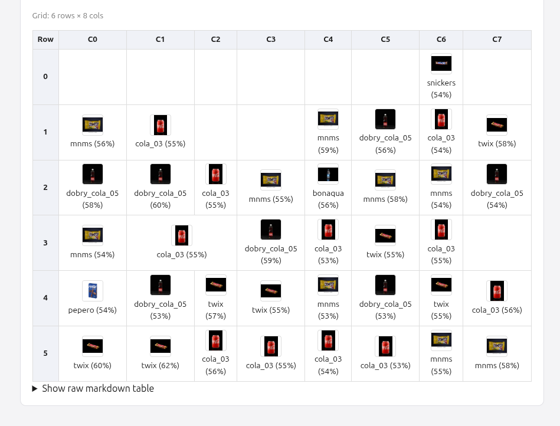
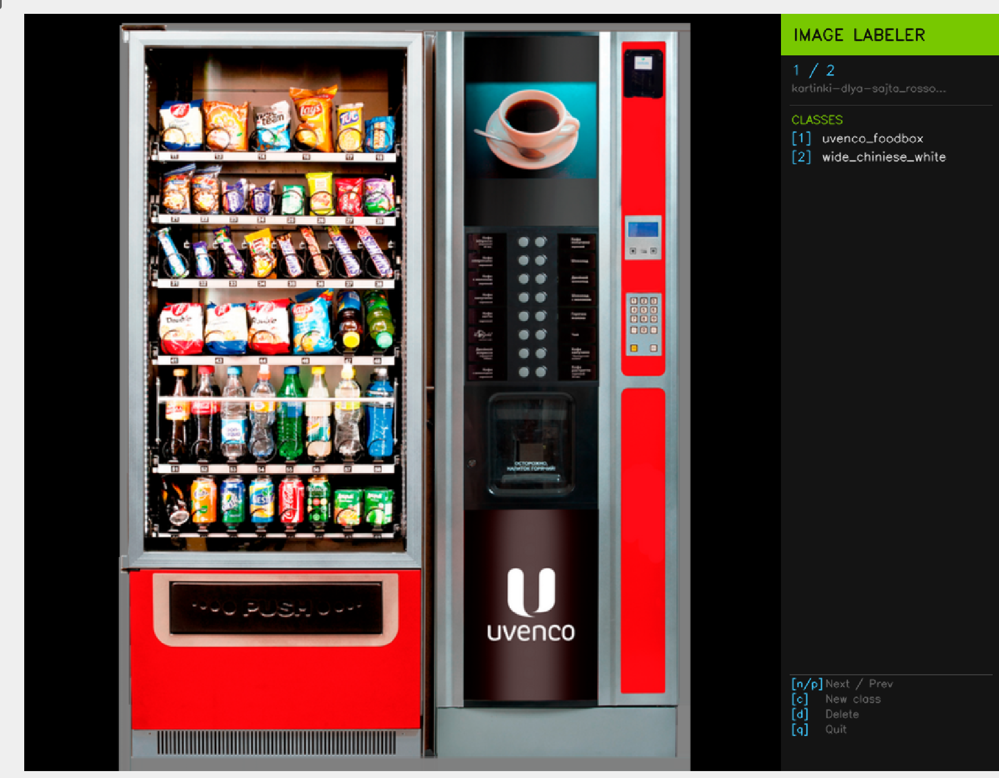
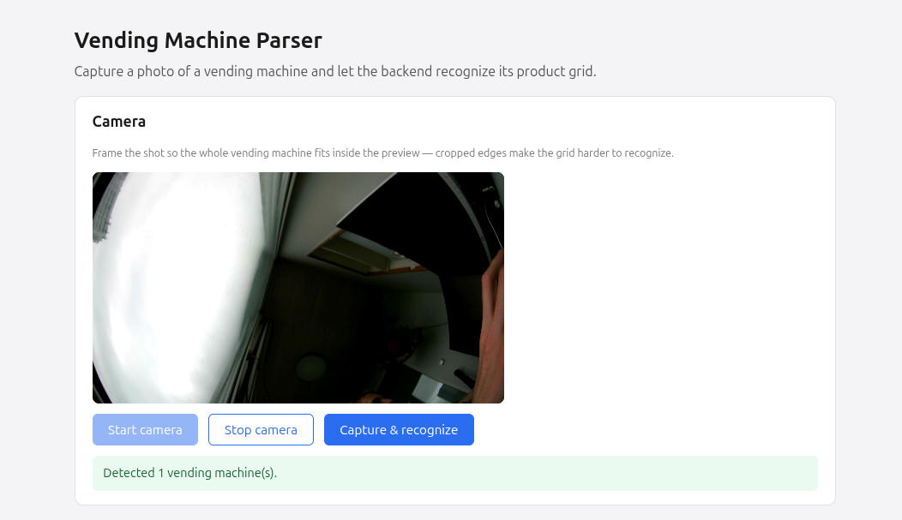

# Vending Machine Parser — Project Report

A computer-vision pipeline that takes a photo of a vending machine, finds the
machine, rectifies its display window, detects every product on the shelves,
classifies each product against a reference gallery, and returns a structured
grid (rows × columns, one product name per cell). A small camera-based web app
sits on top of the FastAPI backend so the whole thing can be used from a phone.

This document is a project report: it explains how the pipeline is designed,
how the datasets behind it were produced, which pretrained models were
adapted and how, what the web app does, and how to set the project up from
scratch.

---

## 1. Pipeline design

The pipeline (`pipeline.py`) chains five specialised models, each handling one
narrow sub-problem. Every stage crops/warps the image for the next stage, so
errors compound — which is the main reason the design favours small, focused
models over one end-to-end network.

```
 photo
   │
   ▼
┌─────────────────────────┐
│ 1. Machine detector     │  YOLOv10n (object detection, single class)
│    → bounding box(es)   │  finds vending machine(s) in the raw photo
└─────────────────────────┘
   │ crop to bbox
   ▼
┌─────────────────────────┐
│ 2. Machine classifier   │  YOLO26n-cls
│    → machine type       │  decides which physical machine model it is
└─────────────────────────┘  (drives expected max rows/cols, see MACHINE_CLASSES
   │                          in shared.py)
   ▼
┌─────────────────────────┐
│ 3. Window segmentator   │  YOLO26n-seg + classical CV post-processing
│    → 4-point polygon    │  (window_segmentator.py): segmentation mask →
└─────────────────────────┘  morphological close/open → Canny edges → largest
   │ perspective warp        contour → binary-search approxPolyDP until exactly
   │ (grid_helper.warp_image)4 corners remain (falls back to convex-hull area
   ▼                          reduction if it can't converge)
┌─────────────────────────┐
│ 4. Item detector        │  YOLO26n-obb (oriented bounding boxes)
│    → product OBBs       │  finds every product on the shelves, rotation-
└─────────────────────────┘  aware so angled shots still yield tight boxes
   │
   ▼
┌─────────────────────────┐
│ 5. Grid builder         │  grid_helper.build_grid — pure geometry, no model:
│    → rows/cols/cells    │  warps OBB corners into rectified window space,
└─────────────────────────┘  clusters items into rows by warped bottom-Y
   │                          (within 3% of the row span), derives a column
   │                          "unit width" from the narrowest 25% of items and
   │                          assigns each item floor(width/unit) column slots
   ▼
┌─────────────────────────┐
│ 6. Item classifier      │  ConvNeXt-Tiny embedding encoder (ArcFace-trained)
│    → product name+score │  + cosine-similarity lookup against a per-class
└─────────────────────────┘  averaged-embedding gallery (item_classification.py
                             / ProductBank). Each grid cell is cropped from the
                             rectified image and matched to the nearest class.
```

The end result is a `GridResult` (rows, columns, per-cell product name +
similarity score) that can be rendered back onto the rectified image
(`render_grid`) or exported as a Markdown table (`build_markdown_table`) —
this is what the API and web app return to the client.



---

## 2. Custom dataset creation

Three of the five models (machine detector, machine classifier, window
segmentator) and the product gallery are trained on **custom, hand-collected
data** specific to this project — there is no public dataset of "photos of
this exact brand of vending machine with labelled shelf windows".

These datasets live under `datasets/` and `gallery/` and were produced with
the helper tools in `scripts/`:

- **`scripts/image_labeler.py`** — an OpenCV-based labeling UI for
  classification datasets. Walks a folder of raw photos, lets you bucket each
  image into a numbered class with a single keypress (`1`–`9`), creates new
  classes on the fly, marks bad images for deletion (with sha256-based
  re-detection so deleted images don't resurface), and pads non-square images
  to a square before saving — keeping the YAML's `nc` field in sync with the
  real class count. Used to build `vending_machine_classification`.
- **`scripts/split_dataset.py`** — splits a labelled folder into train/val,
  padding every image to a square canvas (centered, black background) and
  resizing — the same preprocessing the classification/embedding models expect
  at inference time, so train and serve paths match.
- **`scripts/delete_trash_images.py`** — scans a dataset for corrupted/
  truncated image files (deep byte-level verification via Pillow, not just
  header checks) so a single bad JPEG doesn't crash a long training run.

The **product gallery** (`gallery/<product_name>/*.jpg`) is a small reference
set of clean product photos (e.g. `cola_03`, `snickers`, `twix`, `lays`,
`mnms`, `pepero`, `bonaqua`, `dobry_cola_05`). `notebooks/build_library.ipynb`
walks this folder, runs the item detector on each image, crops the largest
detected OBB, embeds it with the fine-tuned ConvNeXt encoder, **averages all
embeddings per class**, and saves the resulting matrix to
`models/tuned/items_classification.npy` — this is the reference bank
`ProductBank.lookup()` matches crops against at inference time.


---

## 3. Adapting global / public datasets

Hand-labelling enough vending-machine photos to train an item *detector* from
scratch isn't realistic, so the project leans on two public datasets and
adapts them to this task's label format and domain:

- **SKU-110K** (`datasets/SKU110K_fixed/`) — a large public retail-shelf
  detection dataset (densely packed products on store shelves). Its CSV
  annotations are converted to Ultralytics OBB label format by
  `scripts/sku_to_ultralytics_format.py` (per-split CSV → per-image `.txt`
  label files), and corrupted images are pruned with
  `delete_trash_images.py`. This gives the **item detector** (YOLO26n-obb,
  trained in `notebooks/learn_item_detector.ipynb`) a large, diverse base of
  "many small rectangular products on shelves" to learn from — a domain close
  enough to vending-machine windows to transfer well, even though none of the
  source images are vending machines.
- **Retail-YU** (`datasets/Retail-YU_reformed/`) — a retail product-recognition
  dataset, reorganized into an `ImageFolder`/gallery layout
  (`train/`, `val/`, `gallery/`). It is the training data for the **item
  classification embedding model** (`notebooks/learn_item_classification.ipynb`):
  a ConvNeXt-Tiny backbone pretrained on ImageNet-22k→1k
  (`timm/convnext_tiny.fb_in22k_ft_in1k`) is fine-tuned with an **ArcFace
  (additive angular margin) head** on top, via PyTorch Lightning, to pull
  embeddings of the same product together and push different products apart —
  exactly the property the cosine-similarity gallery lookup needs. `extract_crops_simple.py`
  was used to pull bounding-box crops out of detection-style datasets when
  building/augmenting classification training data this way.

In short: public shelf-detection and retail-recognition datasets supply the
visual *vocabulary* (what a packaged product looks like, in bulk and up close);
the small custom datasets supply the *task-specific geometry* (what this
specific machine and its window look like).

---

## 4. Pretrained models & fine-tuning

All base/pretrained checkpoints live in `models/base/`; fine-tuned project
checkpoints are written to `models/tuned/` (paths wired up centrally in
`shared.MODEL_PATHES`). Each tuned model has a corresponding training notebook:

| Stage | Base checkpoint | Tuned checkpoint | Notebook | Trained on |
|---|---|---|---|---|
| Machine detector | `yolov10n.pt` | `vending_machine_detect_yolov10n.pt` | `learn_vending_machine_detector.ipynb` | `vending_machine_detection` (custom) |
| Machine classifier | `yolo26n-cls.pt` | `vending_machine_classification_yolo26n-cls.pt` | `learn_vending_machine_classification.ipynb` | `vending_machine_classification` (custom) |
| Window segmentator | `yolo26n-seg.pt` | `window_segmentation_yolo26n-seg.pt` | `learn_window_segmentation.ipynb` | `window_segmentation` (custom, trained with rotation/flip/mosaic augmentation) |
| Item detector | `yolo26n-obb.pt` | `items_detect.yolo26n-obb.pt` | `learn_item_detector.ipynb` | `SKU110K_fixed` (public, adapted to OBB) |
| Item embedding encoder | ConvNeXt-Tiny `timm/convnext_tiny.fb_in22k_ft_in1k` (ImageNet) | `items_classification_convnext_tiny.fb_in22k_ft_in1k.pt` (+ ArcFace head) | `learn_item_classification.ipynb` | `Retail-YU_reformed` (public, reformatted) |
| Product gallery | — | `items_classification.npy` (averaged per-class embeddings) | `build_library.ipynb` | `gallery/` (custom reference photos) |

`models/base/` also contains a couple of checkpoints (`yolo11n.pt`,
`yolo26n.pt`) kept around for experimentation that aren't currently wired
into the pipeline.

---

## 5. Web app

`web/` is a small Vite + TypeScript (vanilla, no framework) single-page app
that:

1. Requests camera access (`navigator.mediaDevices.getUserMedia`, rear camera
   preferred, requested at up to 4K so captured frames are sharp enough for
   the detectors) and shows a live preview with a reminder to fit the whole
   machine in frame.
2. Captures a still frame to a canvas and POSTs it as JPEG
   (`multipart/form-data`) to the backend's `POST /recognize`.
3. Renders the response: the rectified shelf image with grid lines/labels
   drawn on it (returned as base64 JPEG), plus an HTML table built from the
   structured per-cell data — each cell shows the recognized product name,
   similarity score, and a reference thumbnail fetched from
   `GET /products/{name}/image`.

It is **served by the FastAPI/uvicorn process itself** (`api.py` mounts
`web/dist` as static files), so frontend and API share one origin — no CORS
configuration, all requests use relative paths. Access is gated by a bearer
token (`tokens.yaml`, persisted client-side via `localStorage` /
`?token=` query param). See [`web/README.md`](../web/README.md) for
frontend-specific build/dev instructions.




---

## Current abilities (summary)

- Detects vending machines in arbitrary photos and classifies the machine type.
- Segments and rectifies the display window under perspective distortion.
- Detects individual products with rotation-aware (OBB) boxes, even when
  densely packed.
- Reconstructs the shelf as a row/column grid purely from geometry (no
  model needed for this step).
- Matches each detected product against a small reference gallery via
  embedding similarity and reports a confidence score per cell.
- Exposes all of the above through a token-gated REST API and a mobile-
  friendly camera web app, with end-to-end results renderable as an
  annotated image or a Markdown table.

---

## Project setup — preparation manual

### 1. Prerequisites

- **Python 3.12.11** (the project is developed and tested against this exact
  version — using a different 3.12.x patch release is probably fine, but a
  different minor version is not guaranteed to work with the pinned wheels
  below, especially the CUDA-enabled `torch` build).
- **Node.js + npm** (only needed if you want to build/modify the web frontend
  — see [`web/README.md`](../web/README.md)).
- A CUDA-capable GPU is strongly recommended for training and is noticeably
  faster for inference, but everything also runs on CPU (`torch.device("cuda"
  if torch.cuda.is_available() else "cpu")` is used throughout).

### 2. Clone & create a virtual environment

```sh
git clone <this-repo-url>
cd vendingMachineParser

python3.12 -m venv .venv
source .venv/bin/activate        # Windows: .venv\Scripts\activate

pip install --upgrade pip
pip install -r requirements.txt
```

> The pinned `torch`/`torchvision`/`torchaudio` wheels in `requirements.txt`
> target CUDA 12.9 (`+cu129`). If you're on CPU-only or a different CUDA
> version, install the matching build from
> https://pytorch.org/get-started/locally/ **before** running
> `pip install -r requirements.txt`, or edit those three lines accordingly.

### 3. Get the datasets

Datasets are **not** committed to the repository (see `datasets/.gitignore`)
because of their size. Download them and place each one under `datasets/`
matching the folder names referenced by the notebooks and `*.yaml` files:

| Dataset | Expected path | Source |
|---|---|---|
| Vending machine detection (custom) | `datasets/vending_machine_detection/` | 📁 **Placeholder — Google Drive link**: `<TODO: insert shared Google Drive folder URL here>` |
| Vending machine classification (custom) | `datasets/vending_machine_classification/` | 📁 **Placeholder — Google Drive link**: `<TODO: insert shared Google Drive folder URL here>` |
| Window segmentation (custom) | `datasets/window_segmentation/` | 📁 **Placeholder — Google Drive link**: `<TODO: insert shared Google Drive folder URL here>` |
| Product gallery (custom reference photos) | `gallery/` | 📁 **Placeholder — Google Drive link**: `<TODO: insert shared Google Drive folder URL here>` |
| SKU-110K (public, reformatted to OBB) | `datasets/SKU110K_fixed/` | 📁 **Placeholder — Google Drive link** (preprocessed copy): `<TODO: insert shared Google Drive folder URL here>` — original: https://github.com/eg4000/SKU110K_CVPR19 |
| Retail-YU (public, reformatted) | `datasets/Retail-YU_reformed/` | 📁 **Placeholder — Google Drive link** (preprocessed copy): `<TODO: insert shared Google Drive folder URL here>` |

> Replace each `<TODO: ...>` with the actual shared Drive link before sharing
> this report externally.

If you'd rather rebuild a dataset from scratch instead of downloading it,
the relevant tool from `scripts/` (see **§2 Custom dataset creation** above)
documents its own usage and CLI flags.

### 4. Get the model weights

Pretrained/fine-tuned checkpoints (`models/base/`, `models/tuned/`,
`models/tuned/items_classification.npy`) are large binary files. Either:

- download them from 📁 **Placeholder — Google Drive link**:
  `<TODO: insert shared Google Drive folder URL here>` and place them under
  `models/base/` and `models/tuned/` matching the paths in `shared.py`, **or**
- retrain them yourself by running the notebooks in `notebooks/` in this
  order (each one loads a base checkpoint, fine-tunes it, and saves the
  result to the path `shared.MODEL_PATHES` expects):
  1. `learn_vending_machine_detector.ipynb`
  2. `learn_vending_machine_classification.ipynb`
  3. `learn_window_segmentation.ipynb`
  4. `learn_item_detector.ipynb`
  5. `learn_item_classification.ipynb`
  6. `build_library.ipynb` (depends on 4 and 5 — builds the product gallery
     embeddings from `gallery/`)

### 5. Configure access tokens

Copy the example token file and replace the placeholder values:

```sh
cp tokens_example.yaml tokens.yaml
```

Edit `tokens.yaml` and pick real secrets for each client
(`web-app`, `dev`, …) — these are the bearer tokens clients must send as
`Authorization: Bearer <token>`. `tokens.yaml` is git-ignored; never commit
real tokens.

### 6. Build the web frontend (optional but recommended)

```sh
cd web
npm install
npm run build      # produces web/dist/, served by api.py
cd ..
```

See [`web/README.md`](../web/README.md) for frontend dev-server instructions.

### 7. Run the backend

```sh
python3 api.py
```

This starts uvicorn on `http://0.0.0.0:8004`, mounts `web/dist` (if built) at
`/`, and exposes:

- `POST /recognize` — upload a photo (`multipart/form-data`, field `file`),
  get back parsed machine grid(s).
- `GET /products/{name}/image` — fetch a reference thumbnail for a gallery
  product.

Open `http://localhost:8004/?token=<your-token>` in a modern browser to use
the camera web app (camera access requires `https://` or `localhost`).

---

## Further work

- **Grow the custom dataset.** The window-segmentation model fails fairly
  often on real-world shots — odd viewing angles, reflections/glare on the
  glass, partial occlusion, and lighting variation all trip it up, which then
  cascades into a failed perspective warp and a skipped detection
  (`pipeline.py` simply logs `"failed to segment window"` and moves on).
  More varied, harder examples in `window_segmentation` (and likely
  `vending_machine_detection`/`vending_machine_classification` too) should
  meaningfully improve robustness.
- **Fine-tune the embedding model further.** The product-classification
  embedding model (ConvNeXt-Tiny + ArcFace) currently produces fairly weak
  separation between classes — cosine-similarity scores on real grids often
  sit close to zero and sometimes pick the wrong product (see the sample
  output in `workspace/temp.md`, where many cells are confidently mislabeled
  between e.g. `cocacola` and `snickers`). A larger/cleaner training set,
  more aggressive augmentation matching real capture conditions (angle,
  lighting, partial occlusion), and/or more training epochs on
  `Retail-YU_reformed` (or an expanded equivalent) would likely raise
  separation and overall lookup accuracy.


