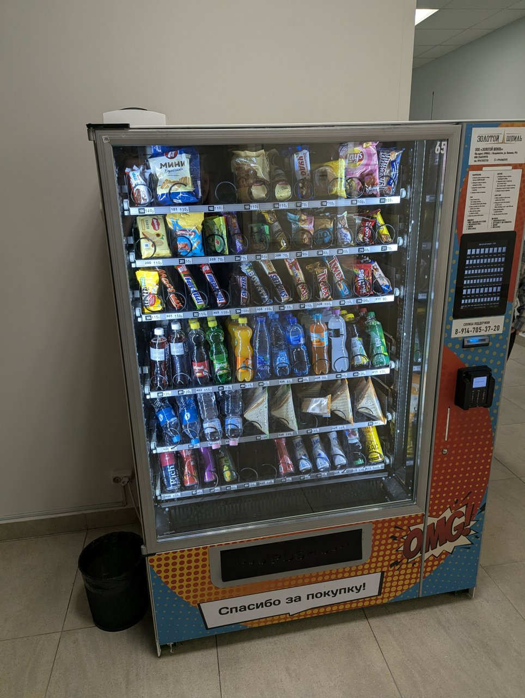
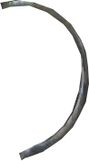
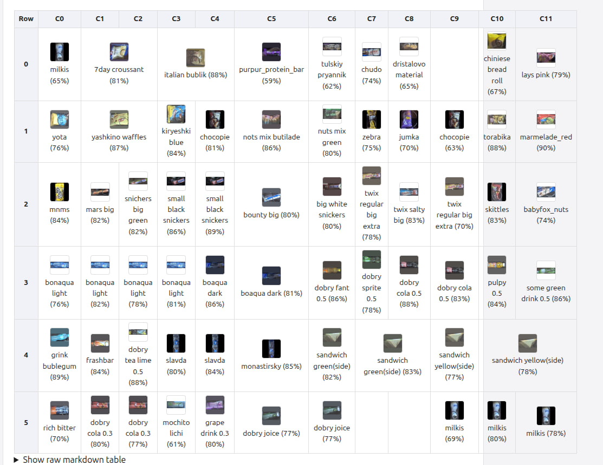

# Vending Machine Parser — Project Report

A computer-vision pipeline that takes a photo of a vending machine, finds the
machine, rectifies its display window, detects every product on the shelves,
classifies each product against a reference gallery, and returns a structured
grid (rows × columns, one product name per cell). A small camera-based web app
sits on top of the FastAPI backend so the whole thing can be used from a phone.

This document is a project report: it explains how the pipeline is designed,
how the datasets behind it were produced, which pretrained models were
adapted and how, what the web app does, and how to set the project up from
scratch.

---

## 1. Pipeline design

The pipeline (`pipeline.py`) chains five specialised models, each handling one
narrow sub-problem. Every stage crops/warps the image for the next stage, so
errors compound — which is the main reason the design favours small, focused
models over one end-to-end network.

```
 photo
   │
   ▼
┌─────────────────────────┐
│ 1. Machine detector     │  YOLOv10n (object detection, single class)
│    → bounding box(es)   │  finds vending machine(s) in the raw photo
└─────────────────────────┘
   │ crop to bbox
   ▼
┌─────────────────────────┐
│ 2. Machine classifier   │  YOLO26n-cls
│    → machine type       │  decides which physical machine model it is
└─────────────────────────┘  (drives expected max rows/cols, see MACHINE_CLASSES
   │                          in shared.py)
   ▼
┌─────────────────────────┐
│ 3. Window segmentator   │  YOLO26n-seg + classical CV post-processing
│    → 4-point polygon    │  (window_segmentator.py): segmentation mask →
└─────────────────────────┘  morphological close/open → Canny edges → largest
   │ perspective warp        contour → binary-search approxPolyDP until exactly
   │ (grid_helper.warp_image)4 corners remain (falls back to convex-hull area
   ▼                          reduction if it can't converge)
┌─────────────────────────┐
│ 4. Item detector        │  YOLO26s-obb (oriented bounding boxes), run only
│    → product OBBs       │  inside the rectified window's bounding rect
└─────────────────────────┘  (grid_helper.mask_to_polygon / offset_obb crop
   │                          everything else out before detection, then map
   │                          results back to photo coordinates)
   ▼
┌─────────────────────────┐
│ 4b. OBB merge           │  grid_helper.merge_overlapping_items — union-find
│    → deduplicated OBBs  │  over pairwise rotated IoU (ITEM_MERGE_IOU), plus a
└─────────────────────────┘  containment pre-pass (ITEM_MERGE_CONTAINMENT) that
   │                          drops any box almost entirely covered by a
   │                          larger one (duplicate sub-detections)
   ▼
┌─────────────────────────┐
│ 5. Grid builder         │  grid_helper.build_grid — pure geometry, no model:
│    → rows/cols/cells    │  warps OBB corners into rectified window space,
└─────────────────────────┘  clusters items into rows by warped bottom-Y
   │                          (within 5% of the row span), derives a column
   │                          "unit width" per row from the 10th-25th
   │                          percentile of gaps between item centers, assigns
   │                          each item floor(width/unit) column slots, and
   ▼                          aligns each row's borders to a reference row via DP
┌─────────────────────────┐
│ 6. Item classifier      │  ConvNeXt-Tiny embedding encoder (ArcFace-trained)
│    → product name+score │  + cosine-similarity lookup against a per-class
└─────────────────────────┘  averaged-embedding gallery (item_classification.py
                             / ProductBank). Each grid cell's OBB is cropped
                             directly from the *original* photo via
                             crop_obb_rotated — de-skewed by its rotation
                             angle, canonicalized to landscape, and padded to
                             a square with black (matching how the training
                             crops are built) — then matched to the nearest
                             class.
```

All numeric thresholds along this chain — detector confidences/IoUs, the
merge IoU/containment ratios, and the per-model `imgsz` passed to each YOLO
model — live in a single `Config` dataclass (`shared.py`), persisted to
`config.json`. They can be tuned live, on a real photo, with
`scripts/tune_item_detector.py` (a slider UI that re-runs detection + merging
on every change and saves accepted values back to `config.json`) without
touching any source file.

The end result is a `GridResult` (rows, columns, per-cell product name +
similarity score) that can be rendered back onto the original photo —
overlaid with the window outline, individual item boxes, and the grid lines/
labels (`render_overlay`) — or exported as a Markdown table
(`build_markdown_table`); this is what the API and web app return to the
client.


---

## 2. Custom dataset creation

Three of the five models (machine detector, machine classifier, window
segmentator) and the product gallery are trained on **custom, hand-collected
data** specific to this project — there is no public dataset of "photos of
this exact brand of vending machine with labelled shelf windows".

These datasets live under `datasets/` and `gallery/` and were produced with
the helper tools in `scripts/`:

- **`scripts/image_labeler.py`** — an OpenCV-based labeling UI for
  classification datasets. Walks a folder of raw photos, lets you bucket each
  image into a numbered class with a single keypress (`1`–`9`), creates new
  classes on the fly, marks bad images for deletion (with sha256-based
  re-detection so deleted images don't resurface), and pads non-square images
  to a square before saving — keeping the YAML's `nc` field in sync with the
  real class count. Used to build `vending_machine_classification`.
- **`scripts/split_dataset.py`** — splits a labelled folder into train/val,
  padding every image to a square canvas (centered, black background) and
  resizing — the same preprocessing the classification/embedding models expect
  at inference time, so train and serve paths match.
- **`scripts/verify_and_resave_images.py`** — multiprocessed OpenCV pass that
  re-encodes every image in a dataset (fixing truncated/corrupt JPEG bytes in
  place) and actively deletes any image — plus its matching label file — that
  fails to load or has an implausible size/channel count. Supersedes the
  earlier Pillow-based `delete_trash_images.py`, which only reported problems.
- **`scripts/gallery_labeler.py`** — the main tool for building/extending the
  product gallery. It runs the *same* `Pipeline.detect(..., classify=False)`
  used in production (machine detect → classify → window segment → item
  detect masked to the window) over a folder of source photos, shows each
  detected crop next to a fuzzy-search/top-5-suggestions panel, and lets you
  accept or correct the label with a few keystrokes. Embeddings are updated
  **incrementally** — `ProductBank.recompute_class()` re-embeds only the
  class(es) that just received new samples — so the gallery can grow without
  a full rebuild. It also runs a startup sync check between
  `gallery/<class>/` folders and the saved embedding matrix, and pops a
  confirmation dialog if a newly-labeled crop's embedding is an outlier
  relative to its class (more than 2× the global mean intra-class distance) —
  a guard against fat-finger mislabels silently corrupting a class's averaged
  embedding.

The custom datasets started small and have grown substantially through
repeated rounds of phone-photo capture and labeling with the tools above —
`vending_machine_detection`, `vending_machine_classification`, and
`window_segmentation` each now hold several hundred labeled images split
80/10/10 (or close to it) across train/val/test, which is enough to run full
training passes for the machine detector, machine classifier, and window
segmentator rather than just smoke-testing them.



The **product gallery** (`gallery/<product_name>/*.png`) is a small reference
set of clean product crops (e.g. `cola_03`, `snickers`, `twix`, `lays`,
`mnms`, `pepero`, `bonaqua`, `dobry_cola_05`), maintained with
`scripts/gallery_labeler.py` above. Each crop is rotation-corrected and
square-padded with `crop_obb_rotated` (the same function used at inference
time), embedded with the fine-tuned ConvNeXt encoder, **averaged per class**,
and the resulting matrix is saved to `models/tuned/items_classification.npy`
— this is the reference bank `ProductBank.lookup()` matches crops against at
inference time. (The original `build_library.ipynb` notebook that performed a
one-shot full rebuild has been retired in favour of this incremental tool.)


---

## 3. Adapting global / public datasets

Hand-labelling enough vending-machine photos to train an item *detector* from
scratch isn't realistic, so the project leans on two public datasets and
adapts them to this task's label format and domain:

- **SKU-110K-R** (`datasets/SKU110K_fixed/`) — a large public retail-shelf
  detection dataset (densely packed products on store shelves), now used via
  its **rotated-box (SKU110K-R) annotations** rather than the original
  axis-aligned CSVs. `DRN_CVPR2020/rotate_augment.py` generates rotated
  copies of every source image plus matching oriented boxes
  (`rbbox=[cx,cy,w,h,angle]`); `scripts/sku110k_r_to_ultralytics_format.py`
  converts these into one Ultralytics OBB `.txt` label per image
  (train/val/test ≈ 57.5k/4.1k/20.6k images, all with real oriented labels —
  previously only the *original*, non-rotated images had labels at all).
  Combined with corrupted-image pruning (`verify_and_resave_images.py`), this
  gives the **item detector** (YOLO26s-obb, trained in
  `notebooks/learn_item_detector.ipynb`) a large, diverse, and now fully
  *rotation-labeled* base of "many small rectangular products on shelves" to
  learn from — a domain close enough to vending-machine windows to transfer
  well, even though none of the source images are vending machines.
- **Retail-YU** (`datasets/Retail-YU_reformed/`) — a retail product-recognition
  dataset (~104k images), reorganized into an `ImageFolder`/gallery layout
  (`train/`, `val/`, `gallery/`). It is the training data for the **item
  classification embedding model** (`notebooks/learn_item_classification.ipynb`):
  a ConvNeXt-Tiny backbone pretrained on ImageNet-22k→1k
  (`timm/convnext_tiny.fb_in22k_ft_in1k`) is fine-tuned with an **ArcFace
  (additive angular margin) head** on top, via PyTorch Lightning, to pull
  embeddings of the same product together and push different products apart —
  exactly the property the cosine-similarity gallery lookup needs. `extract_crops_simple.py`
  was used to pull bounding-box crops out of detection-style datasets when
  building/augmenting classification training data this way.

Between the two public datasets (SKU110K-R ≈ 82k images, Retail-YU ≈ 104k
images) and the now-several-hundred-image custom datasets, every one of the
five fine-tuned models has enough data behind it to support a full training
run rather than a quick proof-of-concept fit.

### Spring/auger occlusion augmentation

Many real vending machines use rotating spring/auger coils to dispense
products, and these coils visually occlude part of the product as a wide arc
in front of the shelf — something neither public dataset contains examples
of. `src/python/spring_augment.py` addresses this with a procedural
augmentation: 18 photographed spring/auger textures on transparent
backgrounds (`datasets/aug_springs/`) are each unwrapped to polar coordinates
once at load time to find their "valid arc span" (excluding the gap where the
coil isn't a full ring), and `random_patch()` then cuts a random sub-arc
(180°–270°) out of the *original* (unwarped) texture via a `cv2.ellipse`
sector mask — no resampling/distortion of the texture.

This is applied two ways: `SpringOcclusionPIL(p=0.3)` as a torchvision
transform on item-classification training crops, and a bbox-anchored
`SpringOcclusion` Ultralytics dataset transform on item-detector training
images — the latter picks a `coverage`-fraction of the ground-truth boxes per
image and overlays a patch sized relative to each target box, so occlusions
land on real products rather than at random image positions.




In short: public shelf-detection and retail-recognition datasets supply the
visual *vocabulary* (what a packaged product looks like, in bulk and up close);
the small custom datasets supply the *task-specific geometry* (what this
specific machine and its window look like); and the procedural spring
augmentation injects a vending-machine-specific occlusion pattern that
neither public dataset has any examples of.

---

## 4. Pretrained models & fine-tuning

All base/pretrained checkpoints live in `models/base/`; fine-tuned project
checkpoints are written to `models/tuned/` (paths wired up centrally in
`shared.MODEL_PATHES`). Each tuned model has a corresponding training notebook:

| Stage | Base checkpoint | Tuned checkpoint | Notebook | Trained on |
|---|---|---|---|---|
| Machine detector | `yolov10n.pt` | `vending_machine_detect_yolov10n.pt` | `learn_vending_machine_detector.ipynb` | `vending_machine_detection` (custom, aggressive Albumentations augmentation) |
| Machine classifier | `yolo26n-cls.pt` | `vending_machine_classification_yolo26n-cls.pt` | `learn_vending_machine_classification.ipynb` | `vending_machine_classification` (custom) |
| Window segmentator | `yolo26n-seg.pt` | `window_segmentation_yolo26n-seg.pt` | `learn_window_segmentation.ipynb` | `window_segmentation` (custom, trained with rotation/flip/mosaic + Albumentations augmentation) |
| Item detector | `yolo26s-obb.pt` | `items_detect_yolo26s-obb.pt` | `learn_item_detector.ipynb` | `SKU110K_fixed` (SKU110K-R, OBB labels for original + rotated images, plus spring/auger occlusion augmentation) |
| Item embedding encoder | ConvNeXt-Tiny `timm/convnext_tiny.fb_in22k_ft_in1k` (ImageNet) | `items_classification_convnext_tiny.fb_in22k_ft_in1k.pt` (+ ArcFace head) | `learn_item_classification.ipynb` | `Retail-YU_reformed` (public, reformatted, with 0/90/180/270° rotation + spring-occlusion augmentation) |
| Product gallery | — | `items_classification.npy` (+ `items_classification_spread.json`, normalized averaged per-class embeddings) | `scripts/gallery_labeler.py` | `gallery/` (custom reference crops, rotation-corrected + black-padded via `crop_obb_rotated`) |

`models/base/` also contains a couple of checkpoints (`yolo11n.pt`,
`yolo26n.pt`) kept around for experimentation that aren't currently wired
into the pipeline.

Every fine-tuned model and the gallery embeddings have gone through at least
one retraining/rebuild pass since the table above first stabilized, each
pass fixing a real train/inference mismatch: embedding-gallery
centroids are now L2-normalized before the cosine-similarity lookup, item
crops are rotation-de-skewed (`crop_obb_rotated`) instead of taking an
axis-aligned box around a rotated OBB, and both training and inference now
pad crops to square with **black** (matching `ProductBank`'s
`_pad_square`) instead of the edge-mean color an earlier revision used.

---

## 5. Web app

`web/` is a small Vite + TypeScript (vanilla, no framework) single-page app
that:

1. Requests camera access (`navigator.mediaDevices.getUserMedia`, rear camera
   preferred, requested at up to 4K so captured frames are sharp enough for
   the detectors) and shows a live preview with a reminder to fit the whole
   machine in frame.
2. Captures a still frame to a canvas and POSTs it as JPEG
   (`multipart/form-data`) to the backend's `POST /recognize`.
3. Renders the response: the rectified shelf image with grid lines/labels
   drawn on it (returned as base64 JPEG), plus an HTML table built from the
   structured per-cell data — each cell shows the recognized product name,
   similarity score, and a reference thumbnail fetched from
   `GET /products/{name}/image`. The table can have a dozen-plus columns
   (one per grid column, e.g. C0–C11 for the wide machines), so it is wrapped
   in a `.table-wrapper` element with `overflow-x: auto` — it scrolls
   horizontally inside its bordered section instead of bleeding past the
   page edge on narrow/mobile screens.

It is **served by the FastAPI/uvicorn process itself** (`api.py` mounts
`web/dist` as static files), so frontend and API share one origin — no CORS
configuration, all requests use relative paths. Access is gated by a bearer
token (`tokens.yaml`, persisted client-side via `localStorage` /
`?token=` query param). See [`web/README.md`](../web/README.md) for
frontend-specific build/dev instructions.




---

## Current abilities (summary)

- Detects vending machines in arbitrary photos and classifies the machine type.
- Segments and rectifies the display window under perspective distortion.
- Detects individual products with rotation-aware (OBB) boxes, even when
  densely packed.
- Reconstructs the shelf as a row/column grid purely from geometry (no
  model needed for this step).
- Matches each detected product against a small reference gallery via
  embedding similarity and reports a confidence score per cell.
- Exposes all of the above through a token-gated REST API and a mobile-
  friendly camera web app, with end-to-end results renderable as an
  annotated image or a Markdown table.

---

## Project setup — preparation manual

### 1. Prerequisites

- **Python 3.12.11** (the project is developed and tested against this exact
  version — using a different 3.12.x patch release is probably fine, but a
  different minor version is not guaranteed to work with the pinned wheels
  below, especially the CUDA-enabled `torch` build).
- **Node.js + npm** (only needed if you want to build/modify the web frontend
  — see [`web/README.md`](../web/README.md)).
- A CUDA-capable GPU is strongly recommended for training and is noticeably
  faster for inference, but everything also runs on CPU (`torch.device("cuda"
  if torch.cuda.is_available() else "cpu")` is used throughout).

### 2. Clone & create a virtual environment

```sh
git clone <this-repo-url>
cd vendingMachineParser

python3.12 -m venv .venv
source .venv/bin/activate        # Windows: .venv\Scripts\activate

pip install --upgrade pip
pip install -r requirements.txt
```

> The pinned `torch`/`torchvision`/`torchaudio` wheels in `requirements.txt`
> target CUDA 12.9 (`+cu129`). If you're on CPU-only or a different CUDA
> version, install the matching build from
> https://pytorch.org/get-started/locally/ **before** running
> `pip install -r requirements.txt`, or edit those three lines accordingly.

### 3. Get the datasets

Datasets are **not** committed to the repository (see `datasets/.gitignore`)
because of their size. Download them and place each one under `datasets/`
matching the folder names referenced by the notebooks and `*.yaml` files:

| Dataset | Expected path | Source |
|---|---|---|
| Vending machine detection (custom) | `datasets/vending_machine_detection/` | 📁 **Placeholder — Google Drive link**: `<TODO: insert shared Google Drive folder URL here>` |
| Vending machine classification (custom) | `datasets/vending_machine_classification/` | 📁 **Placeholder — Google Drive link**: `<TODO: insert shared Google Drive folder URL here>` |
| Window segmentation (custom) | `datasets/window_segmentation/` | 📁 **Placeholder — Google Drive link**: `<TODO: insert shared Google Drive folder URL here>` |
| Product gallery (custom reference photos) | `gallery/` | 📁 **Placeholder — Google Drive link**: `<TODO: insert shared Google Drive folder URL here>` |
| SKU-110K-R (public, reformatted to oriented (OBB) boxes) | `datasets/SKU110K_fixed/` | 📁 **Placeholder — Google Drive link** (preprocessed copy, ~82k train/val/test images): `<TODO: insert shared Google Drive folder URL here>` — original: https://github.com/eg4000/SKU110K_CVPR19 |
| Retail-YU (public, reformatted) | `datasets/Retail-YU_reformed/` | 📁 **Placeholder — Google Drive link** (preprocessed copy, ~104k images): `<TODO: insert shared Google Drive folder URL here>` |

> Replace each `<TODO: ...>` with the actual shared Drive link before sharing
> this report externally.

At this point the dataset sizes are sufficient for full training runs of
all five fine-tuned models, not just quick proof-of-concept fits — see
**§3 Adapting global / public datasets** above for the SKU-110K-R/Retail-YU
counts and **§2 Custom dataset creation** for the custom datasets' size.

If you'd rather rebuild a dataset from scratch instead of downloading it,
the relevant tool from `scripts/` (see **§2 Custom dataset creation** above)
documents its own usage and CLI flags.

### 4. Get the model weights

Pretrained/fine-tuned checkpoints (`models/base/`, `models/tuned/`,
`models/tuned/items_classification.npy`) are large binary files. Either:

- download them from 📁 **Placeholder — Google Drive link**:
  `<TODO: insert shared Google Drive folder URL here>` and place them under
  `models/base/` and `models/tuned/` matching the paths in `shared.py`, **or**
- retrain them yourself by running the notebooks in `notebooks/` in this
  order (each one loads a base checkpoint, fine-tunes it, and saves the
  result to the path `shared.MODEL_PATHES` expects):
  1. `learn_vending_machine_detector.ipynb`
  2. `learn_vending_machine_classification.ipynb`
  3. `learn_window_segmentation.ipynb`
  4. `learn_item_detector.ipynb`
  5. `learn_item_classification.ipynb`
  6. `scripts/gallery_labeler.py` (depends on 4 and 5 — labels reference crops
     into `gallery/<product_name>/` and incrementally builds the product
     gallery embeddings; the older `build_library.ipynb` notebook has been
     retired)

After (or instead of) retraining, detection/merge thresholds can be
re-tuned interactively with `scripts/tune_item_detector.py`, which writes
its results to `config.json` (read by `shared.Config` at startup).

### 5. Configure access tokens

Copy the example token file and replace the placeholder values:

```sh
cp tokens_example.yaml tokens.yaml
```

Edit `tokens.yaml` and pick real secrets for each client
(`web-app`, `dev`, …) — these are the bearer tokens clients must send as
`Authorization: Bearer <token>`. `tokens.yaml` is git-ignored; never commit
real tokens.

### 6. Build the web frontend (optional but recommended)

```sh
cd web
npm install
npm run build      # produces web/dist/, served by api.py
cd ..
```

See [`web/README.md`](../web/README.md) for frontend dev-server instructions.

### 7. Run the backend

```sh
python3 api.py
```

This starts uvicorn on `http://0.0.0.0:8004`, mounts `web/dist` (if built) at
`/`, and exposes:

- `POST /recognize` — upload a photo (`multipart/form-data`, field `file`),
  get back parsed machine grid(s).
- `GET /products/{name}/image` — fetch a reference thumbnail for a gallery
  product.

Open `http://localhost:8004/?token=<your-token>` in a modern browser to use
the camera web app (camera access requires `https://` or `localhost`).

---

## Further work

All five models have since gone through a full retraining pass on the
datasets and augmentations described above (spring/auger occlusion,
SKU-110K-R's oriented labels, rotation augmentation, plus the
train/inference parity fixes — gallery-centroid normalization and consistent
`crop_obb_rotated` black-padding), and recognition results on real photos are
now good. With model accuracy no longer the bottleneck, the remaining work is
about gallery coverage, grid correctness, and runtime cost:

- **Grow the product gallery.** Recognition accuracy is now limited mainly by
  how many real products `gallery/` has reference crops for, not by the
  embedding model itself. `scripts/gallery_labeler.py` makes adding new
  products incremental — label a few crops of a new product, the tool
  recomputes that class's centroid, and it's immediately available to
  `ProductBank.lookup()`. The natural next step is simply running it against
  more captured photos to widen SKU coverage (and, while doing so, adopting
  a naming convention for reference images the matcher should *not* treat as
  a valid product — e.g. blanks/occluded shots that shouldn't pull a cell
  toward any class).
- **Handle empty shelf slots in the grid.** `grid_helper.build_grid` currently
  derives rows/columns purely from *detected* items, so an empty slot (no
  product on a shelf) has no corresponding OBB and either shifts the
  column numbering of everything after it or is silently dropped from the
  grid. The item detector/grid builder should be tuned to recognize these
  gaps and either suppress them from the displayed table while still
  reserving their row/column position (so the rest of the grid stays
  correctly aligned), or show them as explicit "empty" cells.
- **Optimize pipeline compute time.** `pipeline.py` currently runs its models
  strictly sequentially per photo, and the item classifier runs once per
  detected cell. Likely wins: batching the per-cell embedding lookups into a
  single forward pass, caching/reusing intermediate results (e.g. the
  rectified window) across repeated requests, and checking whether the
  `yolo26s-obb` item detector needs its current `736px` input size or can run
  smaller without losing recall.


